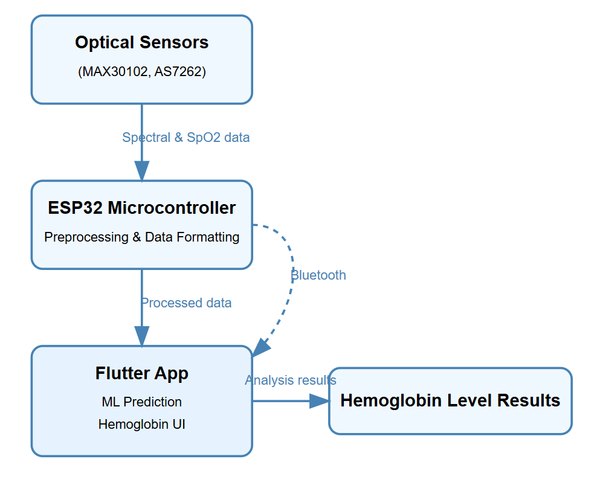

# 🚀 Project Name : Non-Invasive hemoglobin monitoring device with mobile application.

**Team Name:** _Team Phoenix_  
**Hackathon:** _FantomCode'25 & season 4_  
**Date:** _11/04/2025 & 12/04/2025_

---

## 📖 Table of Contents

1. [Introduction](#-introduction)
2. [Problem Statement](#-problem-statement)
3. [Solution Overview](#-solution-overview)
4. [Tech Stack](#-tech-stack)
5. [Architecture / Diagram (if any)](#-architecture--diagram-if-any)
6. [Installation & Usage](#-installation--usage)
7. [Team Members](#-team-members)

---

## 🧠 Introduction

_Our project is a portable, non-invasive hemoglobin monitoring system designed to make affordable and accessible health tracking possible - especially in rural and resource-limited settings._

_it uses optical sensors and machine learning algorithms to estimate hemoglobin levels from light absorption data, eliminating the need for painful blood tests, providing users with real-time results on their smartphones._

_this device is built with low-cost hardware and aims to empower individuals, healthcare workers, and community clinics with tools to monnitor anemia and related conditions effectively._

---

## ❗ Problem Statement

_Anemia affects over 2 billion people globally, with India alone accounting for 57% of women aged 15-49 suffering from it (NFHS-5, 2019-21). Despite this, regular hemoglobin testing remains a challenge due to:_

_High cost and invasiveness of traditional methods (blood draws, lab tests)._

_Lack of access to diagnostic tools in rural and remote areas._

_No real-time, portable, or continuous monitoring solutions available._

_This diagnostic gap delays treatment and increases the risk of complications, especially for women, children, and the elderly in underprivileged communities._

---

## ✅ Solution Overview

_We’ve developed a compact device that estimates hemoglobin levels non-invasively using light-based sensors and an AI-powered mobile application._

_🧪 How it works:
Sensors (AS7262 & MAX30102) capture spectroscopic and SpO₂ data from the skin._

_ESP32 microcontroller processes and transmits data via Bluetooth._

_A mobile app built with Flutter receives the data and runs it through a machine learning model trained to predict hemoglobin concentration._

_Real-time results are displayed to the user, making it ideal for home use, community health workers, and small clinics._

_🎯 Key Features:
✅ Non-invasive: No needles, no pain._

_✅ Portable & lightweight: Easily carried anywhere._

_✅ Affordable: Hardware costs are low._

_✅ Real-time monitoring: Immediate results on mobile app._

_✅ Environmental monitoring scope: Sensor support for light quality._

_✅ Scalable: Potential integration with government health programs._

---

## 🛠️ Tech Stack

- **Frontend:** _Flutter – Cross-platform mobile app (Android & iOS)_  
- **Backend:** _On-device ML model for hemoglobin prediction (lightweight, optimized model)_  
- **Libraries:** _TensorFlow Lite – For running ML model on mobile
  Bluetooth Serial – For communication between ESP32 and app
- **Tools:** _Figma – UI/UX design
  Git & GitHub – Version control
  Colab – Model training and data analysis._

---

## 🧩 Architecture / Diagram (if any)


---

## 🧪 Installation & Usage

### Prerequisites

- Flutter (Xcode for IOS , Android Studio for Android Phones)
- Arduino IDE
- GOOGLE Colab
- Dependencies listed in `pubspec.yaml`

### Steps

```bash 
#for mobile application
flutter pub get

# Navigate into the project directory
cd ios 

# Install dependencies
pod install

# Navigate into the project directory
cd ..

# Start the development server
flutter run

```

---

### Commits

1st Commit - 1:00 pm 
- File Name - dataset_code.py
- model training with the tensorflow in Google Colab

2nd commit - 5:00 pm 
- folder Name - nova_flutter_app
- A Mobile Application development with flutter for integrating the project

3rd commit - 9:00 pm
- folder name - device_code
- file name - device.cpp
- A code which is used for collecting data from the sensors and calculate the required features

4th commit - 2:00 am
- folder name - Google_colab , lib 
- file name - dataset_code.py , main.dart 
- Code to complete the traained model and application for main.dart which was cleaned with errors

5th commit - 7:00 am 
- folder name - device_code , lib
- file name - device.cpp , main.dart 
- A code which is used for collecting data from the sensors and calculate the required features and application for main.dart which was cleaned with errors

6th commit - 10:30 am
- A Complete Project of this hackathon has been successfully executed and completed in the given time.


---

## Team Members 

- UMA Y
- KUSHAL D ACHAR
